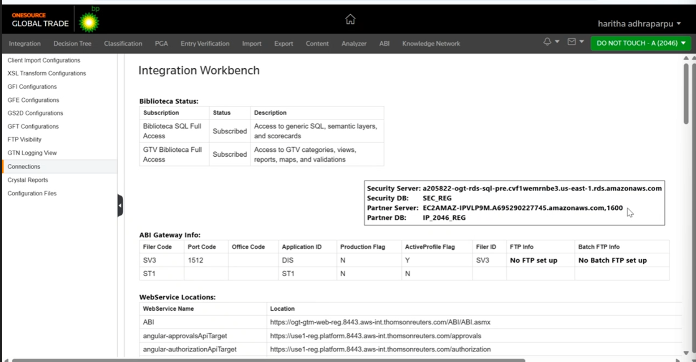
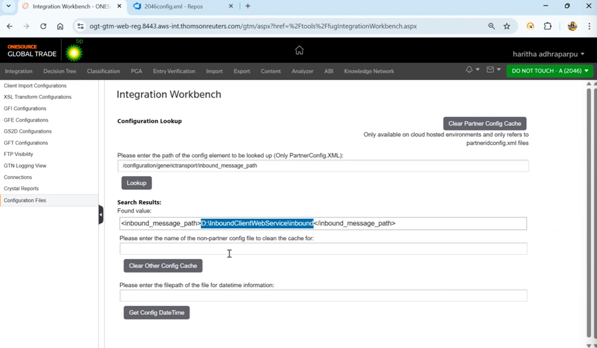

# Meeting Output: Kraken/Genesis - QA KT Session (2025-07-22)

/MeetingOutput with client Thomson Reuters on 2025-07-22 about Kraken/Genesis QA Knowledge Transfer (KT) Session.

## Key action items for Alvaro

- [ ] Investigate the purpose and automation triggers related to the partner config file (XML) in OGT
- [ ] Practice accessing and editing configs via OGT > Profile > Debug (as shown in image 1)
- [ ] Validate that changes to the config are reflected by checking the `inbound_message_path` in the Integration Workbench (as shown in image 2)
- [ ] Test system functionalities after modifying config values for a customer (e.g., landing page, tariff settings)

## Reference Images

**Image 1:** OGT > Profile > Debug (access to change configs)

**Image 2:** Integration Workbench showing `inbound_message_path`

## New testing requirements

- After making changes, verify the system reflects these changes by checking the correct XML path and tag values
- Test all relevant system functionalities that depend on config values (landing page, tariffs, etc.)

## Client priorities

1. Understanding and correctly handling customer-specific configurations
2. Ensuring changes in config files are accurately reflected in the system
3. Functional testing after config changes

## Next deadline

- 2025-07-25: Complete initial round of config change tests and document findings

## Additional context

**Note:** See images above for visual reference of the steps described (Image 1 for config access, Image 2 for XML path verification).

**Contact for escalation:**

- Haritha Adhraparpu (OGT SME)
- Laura Nizer (QA Lead)

**Checklist:**

- [x] All action items are specific and testable
- [x] Deadlines are realistic and clearly stated
- [x] Technical requirements include enough detail for execution
- [x] Client priorities are clearly ranked
- [x] Any blockers or dependencies are noted
- [x] Next steps are defined for both Gustavo and Alvaro
- [x] Contact information is included if Alvaro needs to escalate
