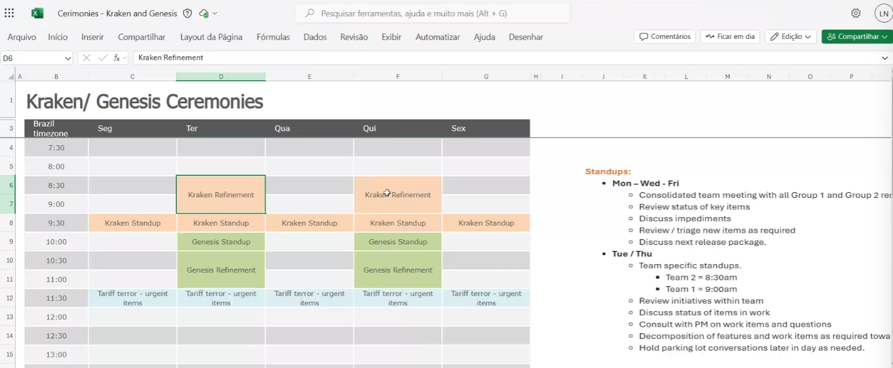

# Meeting Output: Kraken Standup (2025-07-22)

/MeetingOutput with Thomson Reuters on 2025-07-22 about Kraken Standup ceremony changes.

## Key Action Items for Alvaro

- [ ] Understand new ceremony structure (see image)
- [ ] **Kraken work**: Focus on backlog items testing
- [ ] **Genesis work**: Mix of urgent + backlog items
- [ ] Categorize current tickets by Kraken/Genesis split
- [ ] Wait for "FTZ Lookups" ticket assignment (likely test case writing)

## Important Context

Laura Nizer announced ceremony changes starting this release:

- **Kraken team**: Backlog items (planned work)
- **Genesis team**: Urgent items + backlog mix
- See ceremony schedule image for details

**Pending work**: Expecting "FTZ Lookups" ticket assignment - probably test case writing but scope TBD

## Timeline

**Deadline**: 2025-07-25 to adapt testing approach
**Escalate to**: Laura Nizer for process questions

## Reference Image

