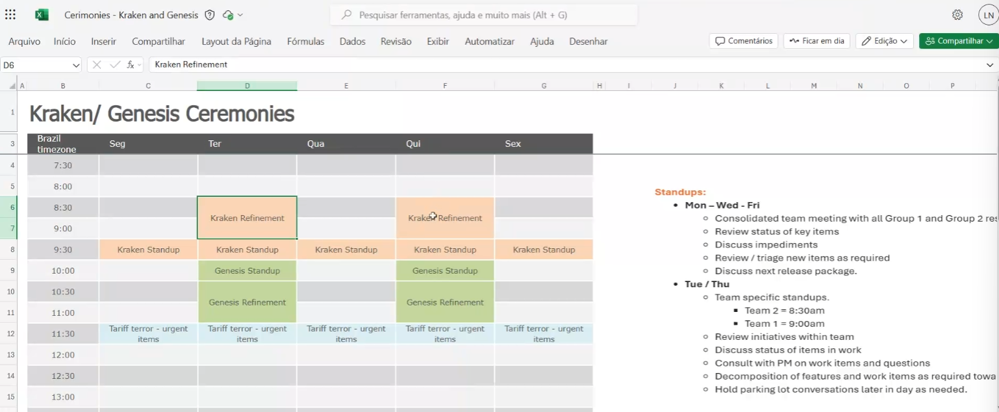

# Meeting Output: Kraken Standup (2025-07-22)

/MeetingOutput with Thomson Reuters on 2025-07-22 about Kraken Standup ceremony changes.

## 🎯 Key Action Items for Alvaro

### Priority Tasks (Do First)
- [ ] Understand the new ceremony structure for this release (see reference image)
- [ ] Adjust testing approach to focus on Kraken backlog items vs Genesis urgent/backlog mix
- [ ] Familiarize with the new standup schedule and team assignments

### New Testing Requirements
- [ ] **Kraken team focus**: Prioritize backlog items testing and validation
- [ ] **Genesis team approach**: Balance between urgent items and backlog work
- [ ] Adapt testing workflows to align with the new ceremony structure

### Changes to Existing Work
- [ ] Review current tickets and categorize them according to new Kraken/Genesis split
- [ ] Align testing priorities with the new ceremony focus areas

---

## 📋 Important Context for Alvaro

### Meeting Background
Laura Nizer led this standup to announce ceremony changes starting this release. The team structure and focus areas are being reorganized to improve efficiency and clarity of responsibilities.

### System/Environment Details
- **Teams affected**: Kraken and Genesis teams
- **New focus areas**: 
  - **Kraken**: Backlog items (planned work, feature development)
  - **Genesis**: Mixed approach (urgent items + backlog work)
- **Ceremony changes**: See reference image for detailed schedule

### Technical Context You Need to Know
The ceremony restructure impacts how work is prioritized and distributed between teams. This affects testing approach and resource allocation.

### Thomson Reuters Priorities Right Now
1. Smooth transition to new ceremony structure
2. Maintaining productivity during the reorganization
3. Clear separation of responsibilities between Kraken and Genesis teams

### What They're Worried About
- Potential confusion during the transition period
- Ensuring urgent items still get proper attention in Genesis
- Maintaining testing quality with new team focus areas

---

## 🔍 Detailed Instructions & Context

### For Current Tickets
- **Kraken-related work**: Focus on systematic backlog testing, planned features, and scheduled releases
- **Genesis-related work**: Balance urgent fixes with backlog items, be ready to pivot for critical issues

### New Testing Scenarios
Test workflows should align with the new team responsibilities:
- Kraken: More structured, planned testing cycles
- Genesis: Flexible testing approach for both urgent and planned work

### Things to Pay Special Attention To
- Understand which team you're supporting for each testing task
- Adapt communication style based on team focus (planned vs urgent work)
- Monitor for any confusion during the transition period

### Workflow/Process Notes
Laura Nizer will be driving these ceremony changes, so escalate any process questions to her.

---

## 💬 Key Takeaways from Meeting

### What Thomson Reuters Liked
- Clear communication about the upcoming changes
- Proactive approach to reorganizing for better efficiency

### Areas for Improvement
- Team members need time to adapt to new structure
- Clear documentation of new responsibilities needed

### Questions They Had
- How the transition will affect current sprint work
- Timeline for full implementation of new ceremonies

### Concerns They Raised
- Ensuring urgent items don't get lost in the new structure
- Maintaining team productivity during transition

---

## 📅 Timeline & Next Steps

**Your Deadline**: 2025-07-25 for understanding new structure and adapting current work approach  
**Next Meeting**: Regular standups following new ceremony schedule  
**What Gustavo Will Present**: Understanding of new team structure and adapted testing approach  
**What You Need to Prepare**: Review current tickets and categorize by Kraken/Genesis focus areas  

### Escalation Contacts
- **Thomson Reuters**: Laura Nizer (ceremony changes and process questions)
- **Internal**: Gustavo for clarification on testing priorities

## Reference Images

**Image 1:** New Kraken/Genesis Ceremony Structure

---
**Meeting documented by**: Gustavo  
**Action items due**: 2025-07-25 for initial adaptation to new structure

**Note:** See image above for visual reference of the new ceremony schedule and team responsibilities.
